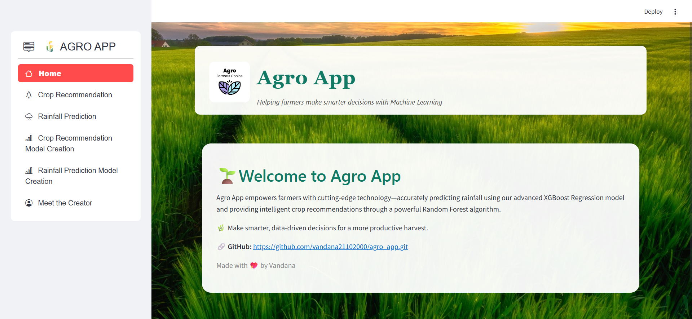

  

Agro App is designed to empower farmers and agricultural analysts with intelligent tools for precision farming. It delivers accurate rainfall predictions using XGBoost and personalized crop recommendations through a Random Forest model. Visualize model training, view code outputs, and make data-driven decisions—all in a user-friendly Streamlit interface.

---

## 📸 Project Screenshots

  
  &nbsp;&nbsp;

## 🧠 Features

Here are some of the core features of the Agro App:

- 🌾 **Crop Recommendation**  
  Predict suitable crops based on soil nutrients, pH, rainfall, temperature, and humidity.

- 🌧️ **Rainfall Prediction**  
  Forecast rainfall levels using historical climate data.

- 📈 **Model Training Notebooks**  
  View end-to-end machine learning pipeline including preprocessing, training, evaluation, and visualization.

- 🧪 **Interactive Jupyter Notebook Viewer**  
  Directly view notebook code and output (including charts) in the app.

- 🖥️ **Streamlit Web Application**  
  Clean, interactive UI for non-coders.

---

## 💻 Built With

Technologies used in this project:

- Python 🐍
- Streamlit 🎈
- Scikit-learn 🤖
- XGBoost 🌿
- Pandas & NumPy 📊
- Matplotlib & Seaborn 📉
- Jupyter Notebook 📓

---

## 🚀 Getting Started

🔗 Useful Links
📂 GitHub Repository: https://github.com/vandana21102000/agro_app

👩‍💻 Author
Made with ❤️ by Vandana Udayakumar

🌟 Show Your Support
If you like the project, consider giving it a ⭐ on GitHub and sharing it with your network!
